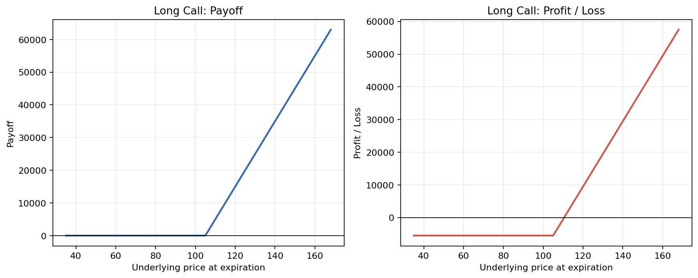
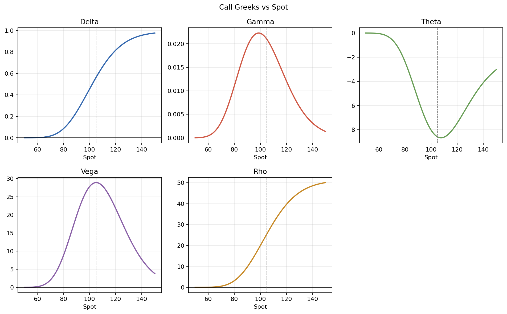
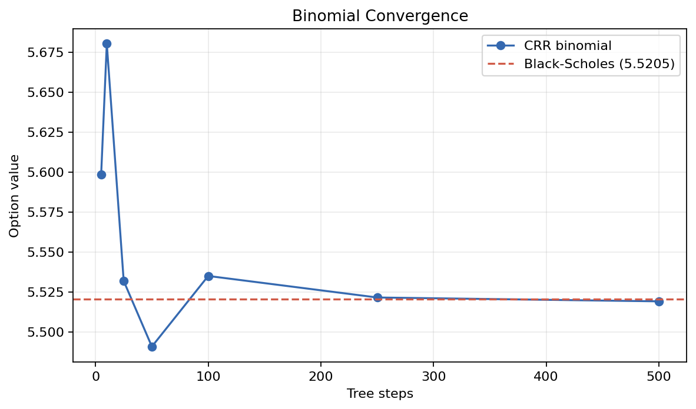

# Derivatives Analytics Report

## Contract

| Field | Value |
|---|---:|
| Contract | European Call |
| Position | Long 10 contract(s) |
| Contract multiplier | 100 |
| Spot | $100.00 |
| Strike | $105.00 |
| Maturity | 0.5000 years |
| Volatility | 25.00% |
| Risk-free rate | 5.00% |
| Dividend yield | 2.00% |

## Pricing

| Model | Value per unit |
|---|---:|
| Black-Scholes | $5.5205 |
| CRR binomial (100 steps) | $5.5349 |
| CRR binomial (500 steps) | $5.5190 |

## Greeks

Vega and rho are shown per 1.00 change in volatility/rate; divide by 100 for a one-point move.

| Greek | Per unit | Position |
|---|---:|---:|
| Delta | 0.454510 | 454.5097 |
| Gamma | 0.022225 | 22.2254 |
| Theta (annual) | -8.032936 | -8032.9362 |
| Vega | 27.781727 | 27781.7267 |
| Rho | 19.965240 | 19965.2399 |

## Expiration Risk

| Metric | Value |
|---|---:|
| Premium used | $5.5205 per unit |
| Maximum profit | Unlimited |
| Maximum loss | $5,520.49 |
| Break-even | $110.52 |

## Charts and Scenarios

Detailed scenario results are in `scenarios.csv`.
