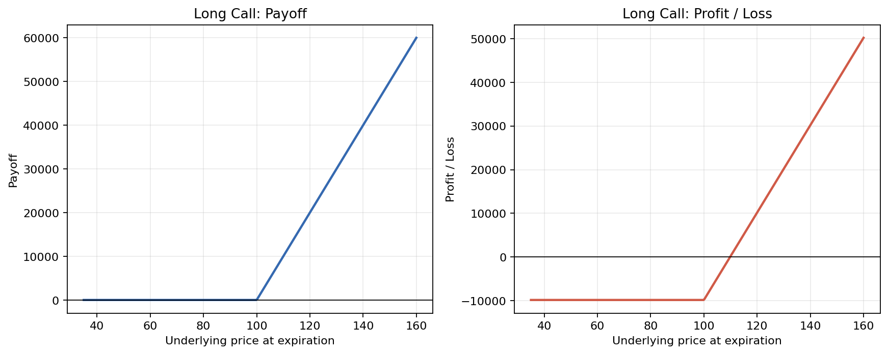
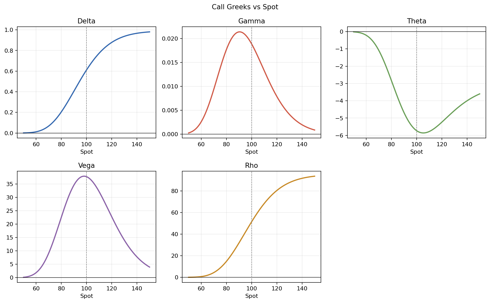
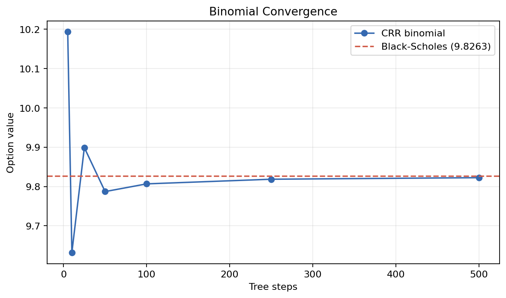

# Derivatives Analytics Report

## Contract

| Field | Value |
|---|---:|
| Contract | European Call |
| Position | Long 10 contract(s) |
| Contract multiplier | 100 |
| Spot | $100.00 |
| Strike | $100.00 |
| Maturity | 1.0000 years |
| Volatility | 20.00% |
| Risk-free rate | 5.00% |
| Dividend yield | 1.00% |

## Pricing

| Model | Value per unit |
|---|---:|
| Black-Scholes | $9.8263 |
| CRR binomial (100 steps) | $9.8066 |
| CRR binomial (500 steps) | $9.8224 |

## Greeks

Vega and rho are shown per 1.00 change in volatility/rate; divide by 100 for a one-point move.

| Greek | Per unit | Position |
|---|---:|---:|
| Delta | 0.611763 | 611.7631 |
| Gamma | 0.018880 | 18.8796 |
| Theta (annual) | -5.731667 | -5731.6669 |
| Vega | 37.759294 | 37759.2943 |
| Rho | 51.350012 | 51350.0123 |

## Expiration Risk

| Metric | Value |
|---|---:|
| Premium used | $9.8263 per unit |
| Maximum profit | Unlimited |
| Maximum loss | $9,826.30 |
| Break-even | $109.83 |

## Charts and Scenarios

Detailed scenario results are in `scenarios.csv`.
