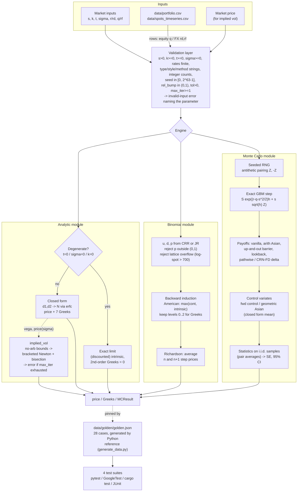
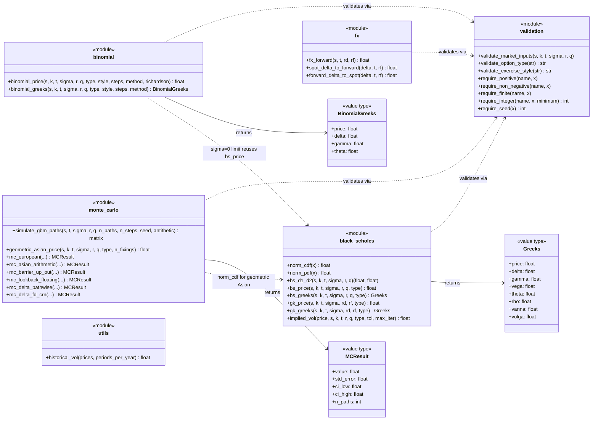
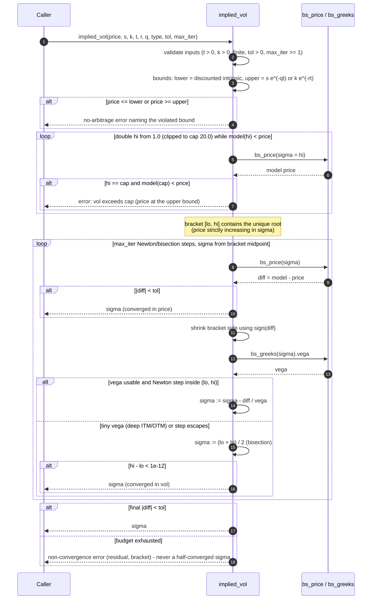

# Architecture

How the `dpe` engine is put together, why the numerical choices were made
the way they were, and how correctness is enforced across four independent
implementations. `API_SPEC.md` at the project root is the normative
contract; this document explains the design behind it.

## 1. Components and responsibilities

The engine is five small modules behind one shared validation layer. The
same decomposition is used in every language (Python modules, C++ headers
under `include/dpe/`, Rust source modules, Java classes in
`com.quant.dpe`):

| Component | Responsibility | Depends on |
|---|---|---|
| `validation` | One chokepoint for every input rule (`s > 0`, `k >= 0`, `t >= 0`, `sigma >= 0`, rates finite, canonical type/style/method strings, integer counts — any `numbers.Integral` in Python — the seed domain `[0, 2^63 − 1]`, `rel_bump ∈ (0, 1)`, `tol > 0`, `max_iter >= 1`). Produces the language's invalid-input error with a message naming the parameter. | — |
| `black_scholes` | Analytic BSM/GK prices, the full Greek set (delta, gamma, vega, theta, rho, vanna, volga), `norm_cdf`/`norm_pdf`, `bs_d1_d2`, and the implied-vol solver. GK is a thin wrapper: `r = rd`, `q = rf`. | validation |
| `binomial` | CRR/JR lattices, European/American backward induction, tree Greeks from one rollback, Richardson averaging, exact `sigma = 0` / `t = 0` limits. | validation, black_scholes (limits) |
| `monte_carlo` | Exact-step GBM simulation; European/Asian/barrier/lookback pricers; antithetic + control variates; pathwise and CRN-FD deltas; the statistics layer (`MCResult`). | validation, black_scholes (`norm_cdf` for the geometric-Asian closed form) |
| `fx` | Covered-interest-parity forward and spot ↔ forward delta conversions. | validation |
| `utils` | Historical (realised) volatility. | — |

Public value types are plain immutable records — `Greeks`,
`BinomialGreeks`, `MCResult` (frozen dataclasses in Python, structs in
C++/Rust, final-field classes in Java). There is deliberately no class
hierarchy, no "Instrument" abstraction and no global state: every function
is a pure map from validated scalars to numbers, which is what makes the
four ports directly comparable and the golden suite meaningful.

## 2. Data flow

(Raw source: `docs/diagrams/pricing_flow.mmd`.)

Data enters from three places: direct market inputs, the demo book
`data/portfolio.csv` (mixed equity/FX rows; FX rows carry `r = rd`,
`q = rf`; one American row is routed to the tree), and the synthetic
time series `data/spots_timeseries.csv` feeding `historical_vol`. All of
it — plus `data/golden/golden.json` — is generated deterministically by
`data/generate_data.py` (seed 20260827), which re-validates the Python
implementation against analytic anchors before writing anything.

## 3. Module and type structure

(Raw source: `docs/diagrams/modules_class.mmd`.)

## 4. Numerical design decisions and trade-offs

**Normal CDF via `erfc`.** `N(x) = 0.5·erfc(−x/√2)` instead of
`0.5·(1 + erf(x/√2))`: in the deep left tail `1 + erf` cancels
catastrophically and destroys all relative precision, exactly where deep
OTM prices live. Python (`math.erfc`) and C++ (`std::erfc`) use the C
library's implementation (glibc: Sun fdlibm `s_erf.c`); Rust's `std` and
Java's `java.lang.Math` have no error function, so those two ports bundle
W. J. Cody's rational Chebyshev approximation (SPECFUN `CALERF`, 37
coefficients over 4 regions, in `rust/src/math.rs` and
`java/.../BlackScholes.java`). Both implementations are accurate to about
an ulp over the whole double range, which is what allows golden tolerances
of 1e-8 (and 1e-10 for the tail case `bs_call_deep_otm`) *across*
languages — a property of two independent algorithms agreeing, not of a
shared library. Trade-off: none worth naming — this is strictly better than
the erf form.

**Exact degenerate limits, not epsilons.** `t = 0`, `sigma = 0` and
`k = 0` are handled by explicit branches returning the analytic limits
(intrinsic, discounted forward intrinsic, forward claim) with second-order
Greeks exactly zero. The alternative — letting `d1 = ±inf` flow through —
produces platform-dependent NaNs. The limit conventions (including the
at-the-boundary tie-break for delta) are written into the contract so all
ports agree bit-for-bit.

**Implied vol: safeguarded Newton, bounds first, honest exit.** The solver
validates `tol > 0` and `max_iter >= 1`, refuses prices at/outside the
no-arb interval *before* iterating (a clear error beats a garbage root),
then runs Newton with analytic vega inside a maintained bracket, falling
back to bisection whenever the step would escape or vega is below 1e-12
(deep ITM/OTM). Guaranteed convergence at bisection speed in the worst
case, quadratic near the root in the common case. There are exactly three
ways out of the loop: `|model − price| < tol`, bracket width `< 1e-12`, or
an error when `max_iter` is exhausted — the function never falls off the
end of the loop and returns whatever sigma it was holding:

(Raw source: `docs/diagrams/implied_vol_seq.mmd`.)

**Tree: O(n) memory, one rollback for Greeks, no silent clamps, no
overflow.** Backward induction keeps a single value vector (O(n) memory,
O(n²) time); terminal spots are built once and divided by `d` per level
rather than re-exponentiated (cheap, and keeps the CRR middle node exactly
on `s`). If the risk-neutral `p` falls outside (0, 1) — drift outrunning
vol at a coarse step — the engine raises rather than clamping, because a
clamped "probability" silently mis-prices; likewise a lattice whose
terminal log-spot excursion `|ln s| + |(r − q − σ²/2)t| + σ√(t·n)` exceeds
700 is rejected up front, because `s·u^n` would otherwise overflow to
`inf` (and `inf · 0` to NaN) with no error. Tree Greeks come from the
first three levels of the *same* rollback (no re-pricing, no bump noise);
when `steps = 2` the "third level" is the terminal level, which the
rollback stores explicitly before the backward loop (the loop only visits
levels `< steps`). The JR lattice drifts, so theta subtracts the
delta/gamma effect of the middle node's spot displacement — a correction
that is identically zero for CRR and keeps the two methods' Greeks
consistent. "Richardson" averaging is plain two-point (`n`, `n+1`)
odd/even averaging, not the Broadie–Detemple BBSR extrapolation: it
cancels the oscillating leading error term for ~2× cost, and is left off
by default because for American options the exercise boundary shifts with
`n` and the theory is weaker.

**Monte Carlo: exact step, honest statistics.** The GBM step is exact in
distribution, so European pricing uses a single step and multi-step grids
exist only where the payoff needs the path (Asian fixings, barrier/lookback
monitoring). The statistics contract is the part most often gotten wrong
in ports and is therefore fully pinned: with antithetics the i.i.d. sample
is the *pair average* (SE over n/2 samples, ddof = 1); the CI multiplier
is the exact constant 1.959963984540054; control-variate β is estimated
in-sample (β = 0 on a degenerate control) and statistics are computed on
the adjusted samples. Barrier and lookback pricers deliberately price the
*discrete* contract with no Broadie-Glasserman-Kou correction — the bias
direction and O(1/√n_steps) rate are documented instead, so the user
chooses the contract rather than the library guessing.

**Determinism vs cross-language RNG.** Every MC function takes an integer
seed in `[0, 2^63 − 1]` (the same domain in all four ports, so a seed is
never silently wrapped or forwarded to an RNG library that rejects it with
its own message) and is deterministic within a language *for a fixed
toolchain*: numpy PCG64 in the reference; in C++ the raw `std::mt19937_64`
output (fully specified by the standard) fed through a fixed Box–Muller
recipe rather than `std::normal_distribution`, whose algorithm is
implementation-defined and differs between libstdc++ and libc++, leaving
only libm's ≤ 1 ulp rounding of `log`/`cos`/`sin` as toolchain dependence;
in Rust `StdRng` of the `rand` version locked in `Cargo.lock` (its stream
is not stable across `rand` major versions); in Java
`SplittableRandom.nextGaussian`, whose algorithm is specified since JDK 17.
RNG streams are *not* required to match across languages — mandating a
shared generator would force every port to hand-roll one. Instead the five
MC golden cases carry statistical tolerances several SE wide, and each
port keeps its own fixed seed. Trade-off accepted: MC goldens catch bias,
not path-level divergence; path-level correctness is covered by each
port's own moment, 3-SE and closed-form single-step tests (one-fixing
Asian ≡ vanilla bit-for-bit; one-date barrier and lookback against their
analytic values).

## 5. Error-handling strategy

One rule everywhere: **invalid inputs never return a number, valid inputs
never return NaN/inf.** All checks funnel through the validation layer so
messages are uniform and name the offending parameter or bound.

| Language | Mechanism | Notes |
|---|---|---|
| Python | `raise ValueError("sigma must be >= 0, got -0.2")` | reference wording |
| C++ | `throw std::invalid_argument` (also for no-arb breaches and non-convergence) | never a silent NaN return |
| Rust | `Result<T, DpeError>` — manual thiserror-style enum with three variants: `InvalidInput`, `NoArbitrage`, `NoConvergence`; **no panics on bad input** | `?`-friendly; demo/tests unwrap |
| Java | `throw new IllegalArgumentException(...)` | messages mirror Python's |

Semantics, not just mechanics, are shared: the *same* violation must fail
in every language (tests assert this), including the subtle ones — implied
vol on a price below intrinsic (error names the lower bound), tree `p`
outside (0, 1) or a lattice that would overflow, odd `n_paths` with
antithetics, `t = 0` implied vol, a negative seed, `rel_bump >= 1`,
`tol <= 0`, `max_iter < 1`, non-finite anything. Solver failure is reported,
not hidden: implied vol exceeding the 2000% bracket cap is an error with
the cap in the message, and exhausting `max_iter` before either stopping
rule is met is an error carrying the residual and bracket (`did not
converge`) — report, don't crash, and never return a half-converged root.
The `steps = 2` tree-Greeks case is the cautionary tale: it was legal per
the contract, crashed in Python and Java, and read out of bounds in C++ —
the one port that "worked" was the one that could have returned garbage.

## 6. Testing strategy

Four independent suites, one shared truth:

* **Golden values** (`data/golden/golden.json`, 28 cases, stored at full
  double precision). Generated once by the Python reference via
  `data/generate_data.py`, which first re-validates itself (analytic
  anchors like the 10.4506 ATM call, put-call parity, implied-vol
  round-trip, CRR-vs-BS convergence at 2000 steps, MC within 3 SE). Every
  port parses the same flat JSON, asserts every `expect` key within the
  case's absolute `tol`, and fails on an unknown case name; no suite pins
  the exact case count. Deterministic cases at 1e-8/1e-10/1e-6; the five
  MC cases (vanilla, CV Asian, single-date barrier, single-step lookback
  call/put) at statistical tolerances (see §4 and `API_SPEC.md` §9.3).
* **Property-style grids** (per language): put-call parity looped over an
  (s, k, t) grid; call price monotone increasing in `s` and decreasing in
  `k`; American ≥ European across a grid; American put premium increasing
  in strike; Asian ≤ vanilla; barrier ≤ vanilla and monotone in the
  barrier level; implied-vol round-trip over a sigma × moneyness grid.
* **Greeks vs finite differences**: analytic delta/gamma/vega/theta/rho/
  vanna/volga checked against central differences of `bs_price` (rel.
  error < 1e-4 for delta/vega); tree Greeks checked against the analytic
  ones at 500 steps; MC pathwise and CRN-FD deltas within a few SE of
  analytic.
* **Edge cases**: exact `t = 0` and `sigma = 0` values, `k = 0`, deep
  ITM/OTM, negative rates, the exactly-ATM tie-break of the degenerate
  Greeks, `steps = 2` tree Greeks, the one-step CRR closed form, exact CRR
  put-call parity on the lattice (and JR's O(dt) parity error), the
  dividend-driven American call premium, the lattice overflow guard,
  invalid inputs raising with the right message in every module (including
  `tol`/`max_iter`, the seed domain, `rel_bump`, bools/floats for integer
  parameters in Python), and implied-vol non-convergence reporting.
* **MC statistical checks**: estimates within 3 SE of analytic; variance
  reduction actually reduces the reported SE (antithetic < plain,
  CV < antithetic); determinism per seed; path-matrix shape and lognormal
  moments; the single-fixing Asian bit-identical to the vanilla engine;
  single-date barrier and single-step lookback within 3 SE of their closed
  forms; the σ = 0 limit (constant payoff, degenerate control, SE ≈ 0);
  every `MCResult` finite with an ordered CI.

Counts after the review round: Python 81 test functions / 150 collected
cases (`cd python && PYTHONPATH=src python3 -m pytest -q`; parametrised
Greeks-vs-FD, invalid-input and golden cases expand the count), C++ 61
GoogleTest cases, Rust 46 tests plus 1 doctest, Java 54 JUnit tests. Each
port mirrors the assertions idiomatically and runs its own golden loop. A
change that shifts any number therefore breaks *four* builds, not one.

### How a desk would use this

A typical intraday flow on an equity or FX vol desk, mapped onto the
engine (all calls are pure functions of scalars, so they slot into any
batch or service layer):

1. **Surface build.** For each quote, `implied_vol(price, s, k, t, r, q,
   type)` with a per-quote `try`/`catch`: a no-arbitrage error means the
   screen price is stale or crossed (flag the point), a non-convergence
   error means the budget/tolerance is wrong for that premium scale (loosen
   `tol` or raise `max_iter`; the default 1e-10 absolute is tight for
   sub-pip FX wings). Never `pass` on either — the contract guarantees you
   get a number only when the solve met a stopping rule.
2. **Pricing and risk.** `bs_greeks` / `gk_greeks` per position (vectorise
   in Python by looping the DataFrame — numpy integer types are accepted for
   `steps`/`n_paths`), `binomial_greeks(..., "american", 500, "crr")` for
   American rows; scale theta by 1/365 and vega by 1/100 at the report
   layer, never inside the engine. For FX, convert the reported spot delta
   with `spot_delta_to_forward` when the surface is forward-delta quoted.
3. **Exotics and Greeks by simulation.** `mc_asian_arithmetic` with the
   geometric control (default), `mc_barrier_up_out` with the *discrete*
   monitoring schedule the term sheet specifies (choose `n_steps` = number
   of fixings; apply BGK yourself if the contract is continuous),
   `mc_delta_pathwise` for vanilla-like payoffs. Quote the standard error
   with every number; pick `n_paths` from the SE you need, not the other
   way round. Pin the seed in the batch config so a re-run reconciles
   bit-for-bit within the same toolchain.
4. **Controls.** Realised vol from closes via `historical_vol` for the
   variance-risk-premium check; the golden suite (`data/golden/golden.json`)
   as the regression gate whenever a port is rebuilt or a compiler is
   upgraded — the same 28 numbers must reproduce in all four languages.

Out of scope, and therefore the desk's own layers: dates and calendars
(the engine takes year fractions), rate and dividend curves (flat scalars),
smile interpolation, and position/limit management.

## 7. C++ engineering toolchain

The C++ implementation is intentionally a modern C++17 library rather than a
single translation-unit demonstration. Its engineering checks are separated from
the numerical contract:

- **CMake 3.16+** defines target-based library, demo, test and optional benchmark
  targets.
- **GoogleTest + CTest** run unit, edge-case, convergence and shared golden-value
  tests.
- **ASan + UBSan** are opt-in through `DPE_ENABLE_SANITIZERS=ON` for GCC/Clang.
- **Google Benchmark** is opt-in through `DPE_BUILD_BENCHMARKS=ON`; benchmark
  targets are not required to build or test the library.
- **Profiling-friendly builds** use `RelWithDebInfo` plus frame pointers through
  `DPE_ENABLE_PROFILING=ON`, suitable for Linux `perf` or macOS Instruments.
- **Compiler diagnostics** use strict warning sets, and the implementation relies
  on strong `enum class` types, `constexpr`, fixed-width integers, RAII/value
  semantics and standard-library facilities.
- **GitHub Actions** executes the normal C++ suite, a sanitizer configuration and
  a benchmark smoke test.

All commands use repository-relative paths. CMake-generated folders (`build*`,
`CMakeFiles`, caches and install scripts) are reproducible local artifacts and are
excluded from version control; absolute paths embedded in them are expected and
must not be copied into documentation.

See [`../cpp/README.md`](../cpp/README.md) for exact commands.

## 8. Performance notes

Complexities (per call): analytic O(1); implied vol O(iterations) with
quadratic Newton convergence (typically < 10 model evaluations, bounded by
`max_iter`); tree O(steps²) time / O(steps) memory (Richardson ≈ 2×; tree
Greeks free — same rollback); MC O(n_paths · n_steps) time. Memory: the
vectorised Python and the Java port both materialise the
`n_paths × (n_steps + 1)` path matrix (Java also the `n_paths × n_steps`
normal matrix), about 16 bytes per path-step — roughly 160 MB for a
100k-path, 100-step barrier; C++ and Rust stream one path at a time in
O(n_steps) memory.

Practical numbers and choices:

* The reference Python is numpy-vectorised end-to-end (path matrices,
  level-vector tree rollback); the full demo — including a 100k-path MC
  section and 2000-step trees — runs in seconds, and the whole pytest
  suite stays well under the 60 s/language budget by trimming MC path
  counts in tests (statistical assertions are sized to the trimmed
  counts).
* MC accuracy budget: SE ∝ 1/√n_paths, so quote the SE, not path counts.
  The control variates buy far more than paths do: the forward control
  cuts the European SE ~5× (≈ 25× fewer paths for equal error) and the
  geometric-Asian control cuts the Asian SE ~20× — use them before
  reaching for more paths.
* Trees: 500 steps ≈ 1e-3 accuracy on ATM European; Richardson at 200
  steps beats plain at 2000. Prefer Richardson to brute-force steps for
  European; for American, moderate step counts (500) with the premium
  cross-checked against a 5000-step reference (as the golden generator
  does).
* Builds are sized for a 2-CPU box: C++ `cmake --build build --parallel`,
  Rust/Java default parallelism; GoogleTest via `find_package`, JUnit from
  the system jar (no network resolution).
* Determinism costs nothing here and is non-negotiable: fixed seeds in
  every demo, test and data generator (seed 20260827 for the bundled
  data), so every number in the README is reproducible to the digit.
